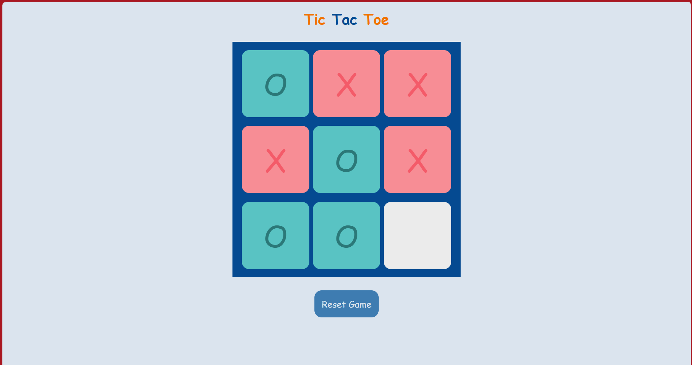

# 🎮 Tic-Tac-Toe Game

## 📸 Preview



---

## 📌 Overview

A simple and interactive **Tic-Tac-Toe game** built using **HTML, CSS, and Vanilla JavaScript**.
This project focuses on core frontend concepts like **DOM manipulation, event handling, and game logic implementation**.

---

## 🚀 Features

*  Two-player gameplay (X vs O)
*  Turn-based system
*  Winner detection logic
*  Draw detection
*  Reset & New Game functionality
*  Prevents overwriting moves (disabled cells)
*  Clean and interactive UI

---

## 🛠️ Tech Stack

* **HTML5** 
* **CSS3** 
* **JavaScript (Vanilla)** 

---

## 🎮 How to Play

1. Open the game in your browser
2. Player **O** starts first
3. Players take turns selecting empty cells
4. First player to get **3 in a row** wins
5. If all cells are filled → it's a **draw**
6. Use:

   * **Reset Game** → restart anytime
   * **New Game** → play again after result

---

## 📂 Project Structure

```id="8ypvrm"
📁 Tic-Tac-Toe
│── index.html
│── styles.css
│── script.js
```

---

## 🌐 Live Demo


---

## 👩‍💻 Author

**Drishti Gupta**
GitHub: https://github.com/drishtiguptaa

